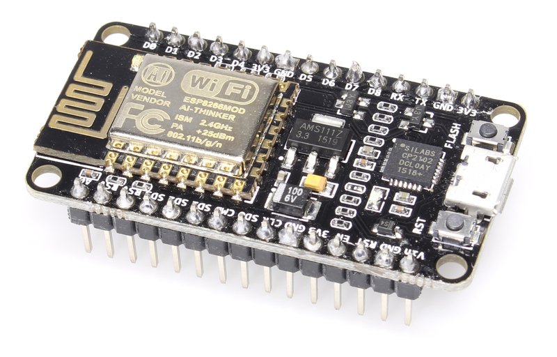
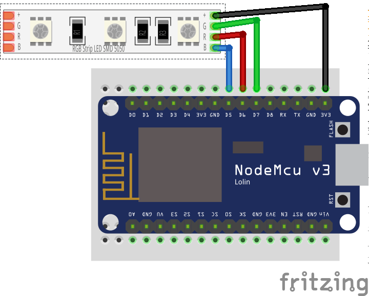

# Getting started

You need two parts to get the Tally Light operational: The Tally Lights themselves
and the Hub that connects your video mixer and the Tallies.

!TODO: graphic here! 

What you need is:

* a **trusted network** that allows access via WiFi
  
  Your video mixer, the Hub and the Tallies need to be able to connect to each other.
  You should take care that there is a close and stable WiFi hotspot near your Tallies
  for obvious reasons. The network you are using should be trusted as all communication
  is unencrypted.
* a **computer** to install the Hub on
  
  The application is rather light weight, so there are no special requirements here
  and it could run other applications in parallel. The Hub has a web interface for
  monitoring and configuration that can be shown on any browser that can connect to
  the computer.
  
* a **NodeMcu ESP8266**
  
  This is an ESP8266 wifi chip on a development board that is typically used for IoT
  applications. As it is an Open Hardware project there are lots of differen boards
  available. They mostly differ in price and form factor and are all fit for the project.
  But they all look similar to this:
  
  
  
  ["NodeMCU Amica"](https://commons.wikimedia.org/wiki/File:Nodemcu_amica_bot_02.png) 
  by "Make Magazin DE", [CC-BY-SA-4.0](https://creativecommons.org/licenses/by-sa/4.0/deed.en)
  
* a piece of **RGB LED** strip
  
  It needs to be specified for 5V and have a common anode.
  Most LED strips that can be separated after _every_ LED should fulfill that requirement. 
  
  I recommend taking one with 120LEDs per meter.

Running the tally lights consists of two steps:

* **Setup the Tally Light**
  
  This means connecting the hardware and flashing the software onto it.
* **Setup the Hub**
  
  This is the piece of software that communicates with your video mixer and all
  connected Tallies and runs on any computer you provide.

## Setting up the Tally

### Connect the hardware

All you need to do is connecting the LED strip to the NodeMCU board.

!!! warning
    Do not connect more than 5 LEDs to the board!
    
    This will drain too much current through the board and potentially damaging it.

| board PIN | strip PIN |
| --- | --- |
| D5 | B |
| D6 | R |
| D7 | G |
| 3V3 | + or +5V |

!!! info
    It is possible to connect the `+5V` pin of the LED strip to `Vin` on the board. But not all NodeMCU boards connect
    the PIN to the USB power supply and your LEDs would stay dark. Have in mind that this is a potential error source.

### Prepare the NodeMCU Toolchain

The NodeMCU documentation very nicely explains all the steps necessary to [start a NodeMCU project](https://nodemcu.readthedocs.io/en/master/getting-started/#getting-started-aka-nodemcu-quick-start).
The documentation might seem overwhelming at first, but you only need to care of the two steps

* Flash Firmware, and
* Upload code

Depending on your Operating System, you should select one – and only one – [tool for each of these steps from
the table](https://nodemcu.readthedocs.io/en/master/getting-started/#task-os-selector).

So either select [NodeMCU PyFlasher](https://nodemcu.readthedocs.io/en/master/getting-started/#nodemcu-pyflasher)
or [esptool.py](https://nodemcu.readthedocs.io/en/master/getting-started/#esptoolpy) to flash the firmware
and follow their installation instruction. Similarly select [ESPlorer](https://nodemcu.readthedocs.io/en/master/getting-started/#esplorer)
or [NodeMCU Tool](https://nodemcu.readthedocs.io/en/master/getting-started/#nodemcu-tool) to upload code and follow
their installation instruction.

### Flash the firmware

When everything is set up flash the firmware.

!TODO: tell where we ship the firmware or how to build it yourself

### Upload Code

Use the tool you have selected to upload the following files to the NodeMCU board:

* every file ending in `.lc`
* `init.lua`
* the `tally-settings.ini` described below

!!! info "tally-settings.ini"
    This file configures your Tally. You can copy `tally-settings.ini.example` over and edit it as needed.

    | setting name | description | 
    | --- | --- |
    | `station.ssid` | The name of the WiFi that the Tally should connect to |
    | `station.password` | The password to connect to the WiFi. If the WiFi has no password, leave it empty. |
    | `hub.ip` | The IP address the hub is running on |
    | `hub.port` | The port where the hub listens. Leave it empty if you use defaults. |
    | `tally.name` | How you want _this_ tally to be labeled in the hub. This name needs to be unique amongst all tallies in your network |

Reboot the NodeMCU board by pressing the `RST` button on the board or disconnecting it from power briefly.

!!! success
    If the LED strip starts blinking blue, this means you have correctly connected the hardware, flashed the firmware
    and uploaded the code.
    
    **Well done!** 

!TODO: elaborate on different NodeMCUs! 

## Setting up the hub

!TODO: where to download from