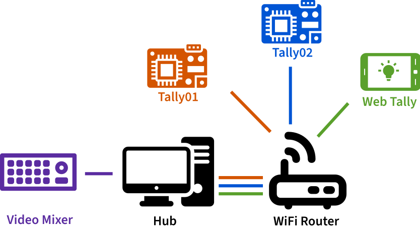

# Getting started

You need two parts to get the Tally Light operational: The Tally Lights themselves,
and the **Hub** that connects your video mixer and the Tallies.

For the Tally Lights you can either build a **WiFi Tally Light** based on NodeMCU
or use a smartphone, tablet, etc to build a **Web Tally**. It is recommended to build
a WiFi Tally Light, as its latency is lower, and they are easier to mount on cameras. But
Web Tallies are a great way to get started with just a smartphone, and can be easily used
for videos inputs coming from a computer, like lower thirds, graphics, etc.

uses icons from the Noun Project by 
[Eucalyp](https://thenounproject.com/browse/?i=3151803),
[Atif Arshad](https://thenounproject.com/browse/?i=1294543),
[priyanka](https://thenounproject.com/browse/?i=1637910),
[Hrbon](https://thenounproject.com/browse?i=3014911) and
[ProSymbols](https://thenounproject.com/browse/?i=1086042), all licensed [CC-BY-3.0](https://creativecommons.org/licenses/by/3.0/us/legalcode)

## Steps

0. Download the latest release [{{ latest_version }}]({{ github_link }}/releases/tag/{{ latest_version }}) and unpack
0. [Setup the Hub](setup-hub.md)
0. Setup the Tallies.
    
    You can do either of those. It is recommended to start with the Web Tally to get
    evaluate the system, but switch to WiFi Tallies in the long run
    
    0. [Setup a Web Tally](setup-web-tally.md)
    0. [Build and setup a WiFi Tally](setup-wifi-tally.md)

## Network Requirements

Your video mixer, the Hub and the Tallies need to be able to connect to each other.
You should take care that there is a close and stable WiFi hotspot near your Tallies
for obvious reasons. The network you are using should be trusted as all communication
is unencrypted.

The WiFi Chip supports `IEEE 802.11 b/g/n` and operates in the `2.4GHz` frequency band.
The WiFi network should support that as well.
