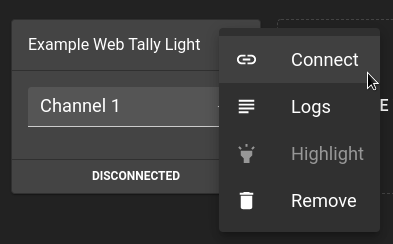
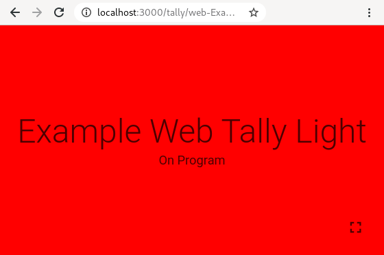

# Set up a Web Tally

A Web Tally is a Tally Light that runs in a browser.

It can convert any smartphone, tablet or anything with a modern browser into a Tally Light without
much effort.

Further down, we elaborate [when and when **not** to use](#pros-cons) Web Tallies, and you should rely
on WiFi Tallies.

But for now a Web Tally is good enough. Let's see the system in action.

## Setup

You should have already [set up the Hub](setup-hub.md). In the web interface click the "Create Web Tally" button
and create a Web Tally and select a channel from your video mixer it should follow. 

You can now connect to that Tally from the menu, by clicking "Connect".

And that's it. Your Tally Light should follow the Video Mixer input. 

!!! info
    We recommend turning adaptive brightness off for devices.
    
    If the browser supports it, screen lock will be disabled when going into full screen.

!!! info
    The url in your browser's address bar can be bookmarked.

## Pros & Cons

### Why to use a Web Tally

* **No additional parts** needed. You already have everything to run it.
* **Having a Web Tally** is better than not having *any* Tally. :D
* Handy for **video material** produced on a **computer**. The Tally Light can be placed anywhere on the screen.

### Why not to use a Web Tally

* **Latency** of a Web Tally is above a WiFi Tally.
* **Form factor** depends on your use case, but a smartphone on top of a camera might be clunky.
* **Network Spam & Distraction**. When using your network for other production-critical applications, like JACK, Art-Net or Dante,
  you might not want a – probably private – smartphone in the same network. It might install updates or show
  an instant messenger notification at the worst possible moment.
* **Easy to use** Once a WiFi Tally is configured, you just need to power it and it is ready to work.

## Conclusion

If you want, go to the next step to learn how to [build and setup a WiFi Tally](setup-wifi-tally.md).
We highly recommend you do it.