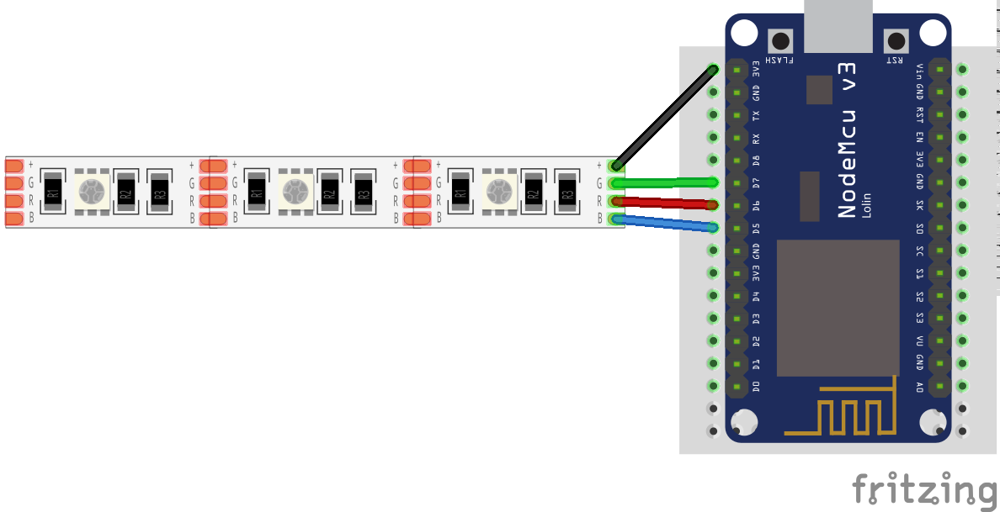
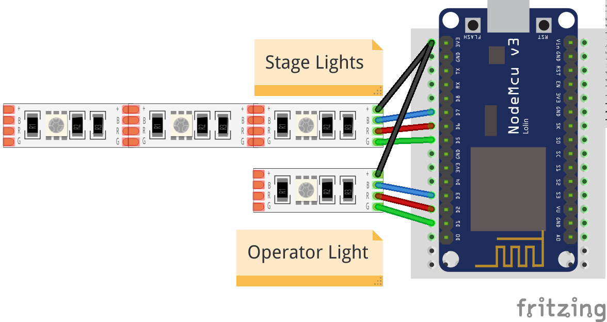

# Build and set up a WiFi Tally

The WiFi Tally is a piece of hardware that connects to the Hub via WiFi.

You do not need any prior experience with hardware projects as this is really
beginner friendly.

!!! info
    Please note that this is the Getting Started Guide, and we follow *one* opinionated
    path here. We don't want to confuse new readers with too many options and alternate paths
    to choose from. If you are curious about alternatives, check out details in the 
    [reference](../tally.md).

## Requirements

You need a few parts to build the WiFi Tally.

### a NodeMcu ESP8266
  
This is an ESP8266 wifi chip on a development board that is typically used for IoT
applications. As it is an Open Hardware project there are lots of different boards
available. They mostly differ in price and form factor and are all fit for the project.
But they all look similar to this:

["NodeMCU Amica"](https://commons.wikimedia.org/wiki/File:Nodemcu_amica_bot_02.png) 
by "Make Magazin DE", [CC-BY-SA-4.0](https://creativecommons.org/licenses/by-sa/4.0/deed.en)

!TODO: elaborate on different NodeMCUs!
  
### a piece of RGB LED strip
  
It needs to be specified for 5V and have a common anode.
Most LED strips that can be separated after _every_ LED and have 4 pins should fulfill that requirement. 

I recommend taking one with 120LEDs per meter to not have the LEDS be spaced too much.

### an USB power source

The whole setup draws far less than `200mA` and can be powered via USB.

* Some cameras have USB outlets that you can use
* `200mA` is little enough that even the smallest power bank can supply the Tally for hours
* use any old USB charger

## Connect the hardware

All you need to do is connecting the LED strip to the NodeMCU board.

!!! warning
    Do not connect more than 5 LEDs to the board!
    
    This will drain too much current through the board and potentially damaging it.

| board PIN | strip PIN |
| --- | --- |
| D3 | B |
| D2 | R |
| D1 | G |
| 3V3 | + or +5V |

!!! info
    It is possible to connect the `+5V` pin of the LED strip to `Vin` on the board. But not all NodeMCU boards connect
    the PIN to the USB power supply and your LEDs would stay dark.
    
    It might also happen that you LED Strip does not work with a lower voltage of the 3.3V output. Typically this does
    not happen, but it could if you have an older strips.

This is how the setup could look like on a breadboard.

### Separate Operator and Stage Light

You can connect a second strip to use as an indicator for the speaker on stage.
Connect the first LED as above and direct it in the direction of the camera operator.
Then connect a second strip and let it face to the front of the camera. 

| board PIN | strip PIN |
| --- | --- |
| D7 | B |
| D6 | R |
| D5 | G |
| 3V3 | + or +5V |

This light will only show preview and live states, but not any error states.
 
## Prepare the NodeMCU Toolchain

The NodeMCU documentation very nicely explains all the steps necessary to [start a NodeMCU project](https://nodemcu.readthedocs.io/en/master/getting-started/#getting-started-aka-nodemcu-quick-start).
The documentation might seem overwhelming at first, but you only need to care of the two steps

* Flash Firmware, and
* Upload code

Depending on your Operating System, you should select one – and only one – [tool for each of these steps from
the table](https://nodemcu.readthedocs.io/en/master/getting-started/#task-os-selector).

So either select [NodeMCU PyFlasher](https://nodemcu.readthedocs.io/en/master/getting-started/#nodemcu-pyflasher)
or [esptool.py](https://nodemcu.readthedocs.io/en/master/getting-started/#esptoolpy) to flash the firmware
and follow their installation instruction. Similarly select [ESPlorer](https://nodemcu.readthedocs.io/en/master/getting-started/#esplorer)
or [NodeMCU Tool](https://nodemcu.readthedocs.io/en/master/getting-started/#nodemcu-tool) to upload code and follow
their installation instruction.

## Flash the firmware

When everything is set up flash the firmware with the tool selected in the previous step.

The firmware is the `.bin` file in the `firmware` folder.

## Upload Code

Use the tool you have selected to upload the following files from the `tally` folder to the NodeMCU board:

* every file ending in `.lc`
* `init.lua`
* the `tally-settings.ini` described below

!!! info "tally-settings.ini"
    This file configures your Tally. You can copy `tally-settings.ini.example` over and edit it as needed.

    | setting name | description | 
    | --- | --- |
    | `station.ssid` | The name of the WiFi that the Tally should connect to |
    | `station.password` | The password to connect to the WiFi. If the WiFi has no password, leave it empty. |
    | `hub.ip` | The IP address the hub is running on |
    | `tally.name` | How you want _this_ tally to be labeled in the hub. This name needs to be unique amongst all tallies in your network. It must not be longer than `26` characters. Use of ASCII characters is recommended. |

    For a list for all configuration values see [tally-settings.ini Reference](../tally.md).

Reboot the NodeMCU board by pressing the `RST` button on the board or disconnecting it from power briefly.

!!! success
    If the LED strip starts blinking blue, this means you have correctly connected the hardware, flashed the firmware
    and uploaded the code.
    
    After a few seconds it should show up in the Hub. Configure a channel there and the WiFi Tally should follow it.
    
    **Well done!** 

!!! info
    If you run into problems, the [Troubleshooting Guide](../troubleshooting.md) should have you covered.

## Conclusion

This concludes the [Getting Started Guide](index.md).

To learn of other options for the Tally Light, see the [reference](../tally.md).