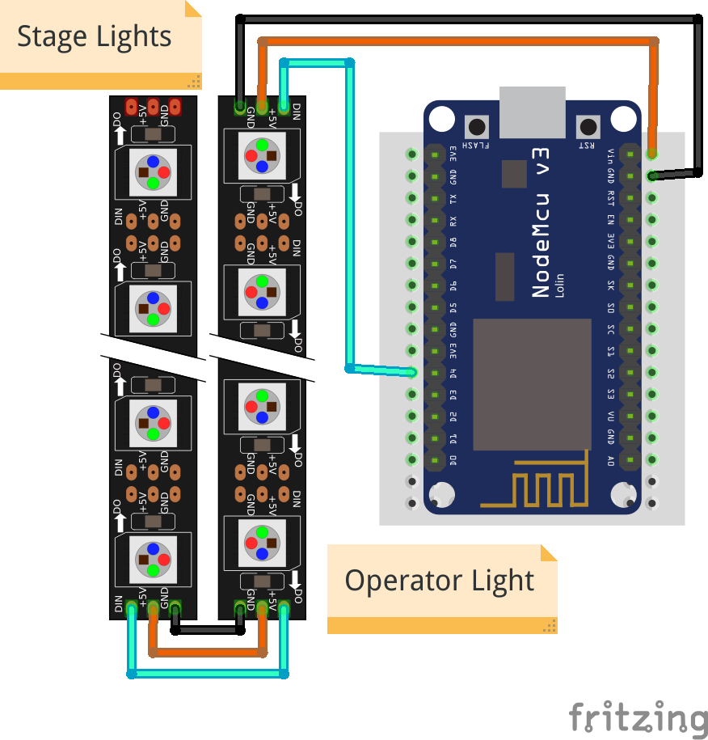
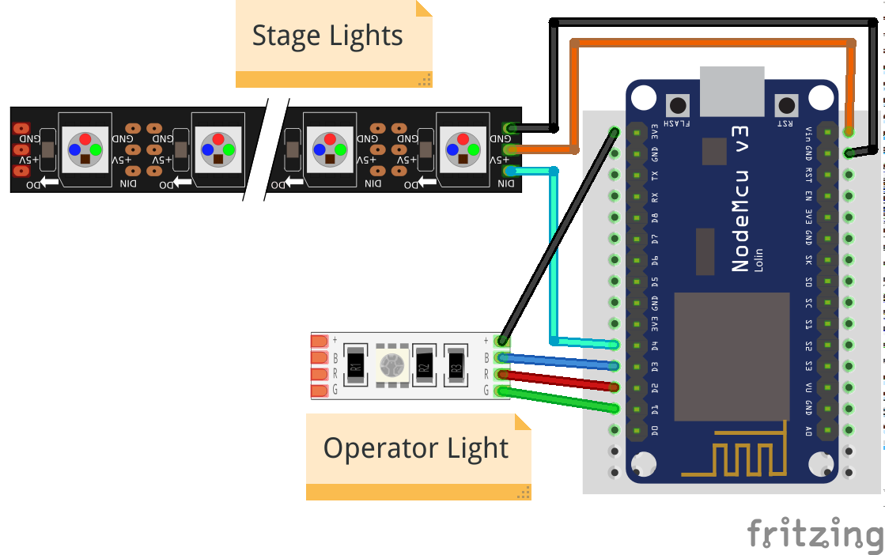

# Tally

## tally-settings.ini Reference

| setting name | default | description |
| --- | --- | --- |
| `station.ssid` | **(required)** |The name of the WiFi that the Tally should connect to |
| `station.password` | (none) | The password to connect to the WiFi. If the WiFi has no password, leave it empty. |
| `hub.ip` | **(required)** | The IP address the hub is running on |
| `hub.port` | `{{ tally_default_port }}` | The port where the hub listens. |
| `tally.name` | (chip id) | How you want _this_ tally to be labeled in the hub. This name needs to be unique amongst all tallies in your network. It must not be longer than `26` characters. Use of ASCII characters is recommended. |
| `operator.type` | `grb+` | What type of RGB-LED strip is driven for the operator light. Use `grb+` for common anode and `grb-` for common cathode. |
| `operator.ws2812` | `5` | Number of WS2812 like LEDs in a strip that serve as operator lights. Has to be a number between `0` and `10`. The operator lights are the first in the strip, followed by the stage lights. |
| `stage.type` | `grb+` | What type of RGB-LED strip is driven for the stage light. Use `grb+` for common anode and `grb-` for common cathode. |
| `operator.ws2812` | `0` | Number of WS2812 like LEDs in a strip that serve as stage lights. Has to be a number between `0` and `10`. The stage  lights come right after the operator lights in the strip. |

## Using WS2812, NeoPixel, etc

WS2812-compatible LED strips come with many names. Most common are `WS2812b` and `NeoPixel`. If you have
anything that says it is compatible with either of those, it will probably work.

Connect the strip to pin `D4`, the `+5V` and `GND` respectively.



By default the first `5` pixels in the strip will work as Operator Lights, the others stay dark.

The number of LEDs you want to use as Operator Lights and Stage Lights can be configured in 
`tally-settings.ini` with the `operator.ws2812` and `stage.ws2812` settings.

In the example above, the correct configuration to drive 4 Operator Lights and 4 Stage Lights
would be

````ini
operator.ws2812 = 4
stage.ws2812    = 4
````

!!! info "Order of LED lights"
    When wiring, please note, that the Operator Lights always come _before_ the Stage Lights.

It is also possible to combine WS2812 strips and RGB Leds in one setup as all pins are driven
simultaneously. You could, for instance use a single RGB LED as the operator light and a
WS2812 strip for the stage light.



The configuration for this example would be

````ini
operator.ws2812 = 0
stage.ws2812    = 4
````
